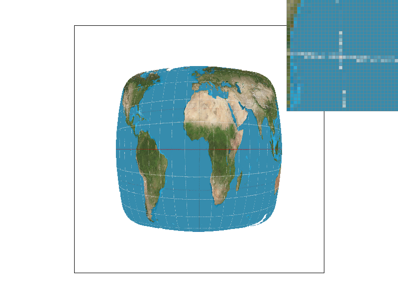

# Homework 1

# Overview

This project aims to go through the basics of rasterization. Starting from the simplest of rasterization of single color trianlges, to other options including supersampling, interpolating colors, and mipmaps for texture mapping. Other tasks include transfomraation operations, and comparrisons between different sampling methods.

#Task 1

We are given that the first task can be completed simply by modifying the rasterize_triangle() function in rasterizer.cpp. I started by computing the bounding box of the triangle: using the minimum of the three x values as the left boundary value, the maximum of the three x values as the right boundary value, and similarly for top and bottom boundary values. Once I had all four boundary values, I simply used a nested for loop to iterate through all x and y pairings, representing all the possible locations of a pixel within the bounding box.

I wrote a separate function, inside(), that would, given an x, y point coordinate and the coordinates for the two endpoints of a triangle edge, return whether the point was inside the edge. For each iteration, I would call the inside function on this iteration's x, y point 3 times, once for each triangle edge. If all three calls evaluated to true, then the point had passed the three-line test, and was thus inside the triangle. Since it was inside the triangle, I could simply call fill_pixel() on this point to color it as part of the triangle.

Since this algorithm literally checks every sample within the bounding box of the triangle, it is trivially no worse than an algorithm that checks each sample within the bounding box of the triangle.

- This task only stated to modify the `rasterize_triangle()` function, but, in order to speed up the process in future tasks, I created two seperate functions: `in_triangle` and `orient2d`. These would allow me to determine whether a point was above or below a line, and whether or not a point is inside of a triangle. Furthermore, in order to not check the entire screen space, I computed the bounding box of the triangle finding the max and min of the x/y coordinates, and looped through them. 
- this algorithm is no worse since it is iterating within the bounding box, therefore it cannot be worse than an algorithm that checks each sample.

`basic/test4.svg` with pixel inspector centered on an example of jaggies. Most notably, look at the red and purple triangle.

#Task 2
- In oder to super sample, I modified the `sample_buffer` data structure by changing the size such that it would be `width * height * sample_rate` in order to "fake" a higher resolution picture. I then also edited `resolve_to_framebuffer` to make it such that we can get different shades of colors by averaging the colors of each sample and then moving it into the `rgb_framebuffer_target`, and finally edited `rasterize_triangle` by adding two nested loops to iterate through the samples for each pixel, which were evenly distributed. Furthermore, I no longer used `fill_pixel`, but instead, edited the `sample_buffer` directly.
- Supersampling is helpful because it allows us to smooth out the jaggies by applying a filter to remove the high frequency changes to produce an anti-aliased image. Although the sampling rate may differ for different scenarios, the ability to remove jaggies is important in and of itself.
- As the sample rate increases, we capture more and more of the polygon based on how much it actually covers in that pixel based on the hue, with a higher opacity meaning a less coverage in that pixel. For samller sample rates, especially the one with the rate of 1, there are missing regions, which are filled in with less colored squares as the sampling rate increases. The islands also become less colored, as it more accurately represents the proportion of its samples that are actualy in the triangle.

Sample Rate: 1             |  Sample Rate: 4
:-------------------------:|:-------------------------:
   |  

Sample Rate: 9             |  Sample Rate: 16
:-------------------------:|:-------------------------:
   |  

#Task 3
This is Mingy, the dapper dabber. I gave him a *sick* pair of shirt, and a pair of jorts. And, of course, he is dabbing.

#Task 4
- Barycentric coordinates is a coordinate system that allows us to interpolate between the vertices, and lets us obtain smooth varying values.
- When used on a triangle, it takes all three verticies and calculates a weighted sum to get each point within the triangle. This can be useful for texture coordinates, or colors, as demonstrated by the images below. 

 *svg/basic/test7.svg*             |  Barycentric Coords Example
:-------------------------:|:-------------------------:
   |  

#Task 5

- Pixel sampling is when we iterate through samples within each pixel that is in the bounding box of the triangle, and calculate the alpha, beta, and gamma weights from the barycentric coordinates. From this, we can calculate a weighted sum of the texture coordinates for the current sample point. 
- The two different pixel sasmpling methods are the Nearest Neighbor, and Bilinear Interpolation. Nearest Neighbor will just take the nearest closest indice in the texture map (by rounding the sample) and use that for the sample. Bilinear will take the the four closest points, and linearly interpolate between them to find the final `Color` object.

Nearest Neighbor Sampling Rate: 1 | Nearest Neighbor Sampling Rate: 16
:-------------------------:|:-------------------------:
   |  

Bilinear Interpolation Sampling Rate: 1  |  Bilinear Interpolation Sampling Rate: 16
:-------------------------:|:-------------------------:
   |  

The biggest difference between the two sampling methods is most clearly shown wen the sampling rates are both 1. You can seethat the nearest neighbor has many more islands, while the bilinear interpolation contains a smoother line, especially in the horizontal direction.

It is less noticible in the sampling rate of 16, which makes sense as a higher sampling rate would mean that each pixel would have to cover less of the texture map and would result in a very similar image to bilinear interpolation.

#Task 6   

- Level sampling is basically determining how much detail do we want based on the original texture by storing worse and worse qualities of the same image (each version being twice as small as the next). Then, we can use the texture file whose resolution would best approximate the sampling rate of the screen. 
  - This was done by creating a `get_levels()` function which would estimate the footprint of the texture based on the neighboring sample points. Because of this, we are able to match the pixel size to the coordinates in the texture map, and then pick one, or interpolate between the closest two levels of the mipmaps.
- Supersampling almost always produced the best antialiasing results, but was more costly in both memory and speed due to the increase of points we have to check. Although Mimaps are also memory intensive due to having to store several images, because it is precomputed, the speed is much faster.
- Bilinear interpolation is more computationally expensive compared to nearest neighbor, but resulted in better antialiasing and removed much of the jaggies and artifacts.

Supersampling consistently produces excellent antialiasing results, but comes at a signficant tradeoff in both speed and memory usage due to the significant increase in sampling occurrences. Mipmaps (level sampling) require more memory in order to store the various resolution level texture images, but gain a boost in speed (from the precomputation) and antialiasing as a result. Bilinear interpolation is less efficient than nearest neighbor as a sampling technique, but the slower speed results in generally better antialiasing, as the process of interpolating neighboring sample points is very effective for removing jaggies and sharp artifacts.

Nearest Neighbor + 0th mip | Bilinear Interpolation + 0th mip
:-------------------------:|:-------------------------:
   |  

Nearest Neighbor + nearest mip level | Bilinear Interpolation + nearest mip level
:-------------------------:|:-------------------------:
   |  

