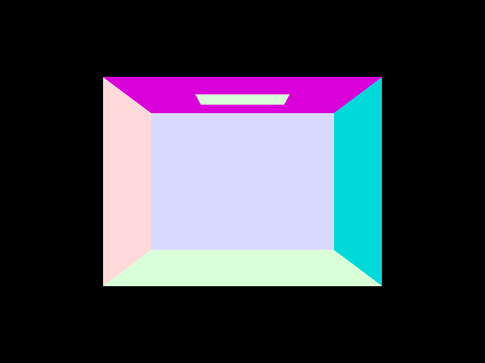
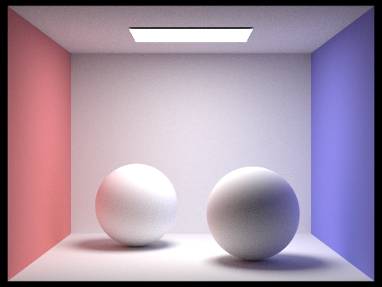

<h1 style="text-align: center;">Homework 3: Path Tracer</h1>
<h2 style="text-align: center;">David Ban </h2>
<h2 style="text-align: center;">Sp 2024 </h2>

# Overview

In this project, I implemented the basics of a path tracer rendering program. This included methods such as:
- Ray Generation and Scene Intersection
- Bounding Volume Hierarchy (BVH)
- Direct and Global Illumination
- Adaptive Sampling

These meant implementing the generation of camera rays and detecting intersections such as ray-triangle and ray-sphere intersections. Furthermore, I implemented the methodology of the BVH structure and applying it to graphics and accelerating the rendering process. Finally, I built the ability to trace rays of light from a source and implemented reflections to allow for multiple object intersections. Finally, adaptive sampling was added to optimize the number of samples and reduce noise, while still being relatively fast.

# Task 1

To generate rays, I edited the function `generate_ray()`. To do this, I ransformed the input into a 3D camer space, and then, using the camera's origin point, defined a Ray object and using a camera-to-world rotation to get the vector in world space. I then normalized the ray, and returned it. The function `raytace_pixel()` would then call the `generate_ray()` function repeatedly to generate random samples within each pixel, and then calculate the estimated radiance along the ray. Then, I would average the sampled values, and set it to the color of the pixel.

`raytace_pixel()` is then called for each pixel within a "tile". If there is a scene intersection (which is detected by a sphere or triangle in our case), then a value is returned which is the accumulation of radiance. 

The triangle intersection algorithm I implemented is the **Moller Trombore Algorithm** which uses barycentric coordinates which I implemented in a previous homework. This will let us determine whether the intersection point is within a triangle, and calculate the 3 values of the barycentric coordinates. If the resulting values are between [0,1], we know that it is inside of the triangle. I also had to check the `min_t` and `max_t` restriction for the t-value, and then, if it passes all of these checks, I would update the `max_t` value to the nearest intersection. 

|   
<b>*CBempty.png*</b>
|   
<b>*CBspheres.png*</b>
|
|--|--|
|   
<b>*CBcoil.png*</b>
|   
<b>*CBgems.png*</b>
|

# Task 2

In order to construct the BVH, I used the recursive approach that was recommended by the spec. To do this, each call would iterate through all of the primitive values between two variables `start` and `end`. For each primitive, the bounding box is expanded, and the  centroids bounding box is also expanded. 

The algorithm also checks whether the number of primitives is greater than or equal to `max_leaf_size`. If it is not, then we know that the node is a leaf node, and we can return it with the same start and end attributes. If it is not a leaf (and is thus greater than or equal to `max_leaf_size`), we need to determine which axis to split off. To do this, we decide which one would provide the most benefit, i.e., which axis has the largest length / range. We then select the axis which has the largest range, and would have the most "benefit".

Then, I sort the primitives by the coordinate value of the axis we've decided, using the `std::sort()` function. Then, we can now recursively call the function with the first and second half of the sorted list of primitives. Sorting allows us to ensure that it is linearly separable.
|   
<b>*cow.png*</b>
|   
<b>*dragon.png*</b>
|
|--|--|
|   
<b>*blob.png*</b>
|   
<b>*CBlucy.png*</b>
|

Using the same amount of threads (8), the `cow.dae` file took approximately 26 seconds to render. However, after implementing BVH acceleration, the render time went to less than 1 second (around 0.1). Similarly, for `CBlucy.dae`, the render time drastically reduced the time by over one hundred times. Based on these two experiments, I have concluded that BVH is very effective at optimizing the rendering process. 

# Task 3

For uniform hemisphere sampling, I first found the number of samples needed (using the `ns_area_light` attribute) and then sample the `hemisphereSampler` to get w_j vectors. For each vector, I transformed the direction into the world space, and then created a new ray, with the origin at `hit_p` and a directional vector of the world space vector. If the sample ray intersected a light source using `intersect()`, then I would calculate the contribution of the sample using the irradiance from the light source. I then averaged it, and returned the value.

For importance sampling, I did a similar approach, except this time I iterated through all of the lights in the scene, and checked if it was a point light source. If it was, then I only needed to do one sample. Else, I would sample `num_samples` times from the light, and once again, create a ray along with a shadow ray similarly as above. If there was an intersection between the shadow_ray and the scene, then I know that the hit point is in a shadow. If there were no intersections, then I could calculate the irradiance, and use the given pdf value to calculate how much it contributed. I then summed, and averaged once again and then returned `L_out`.

### Light Sampling
|   
<b>*bunny.png*</b>
|   
<b>*CBlucy.png*</b>
|
|--|--|

### Uniform Hemisphere Sampling	

|   
<b>*bunny.png*</b>
|   
<b>*CBlucy.png*</b>
|
|--|--|

It is easy to see that uniform hemisphere sampling is, on average, noisier than importance light sampling even with the same ligh rays, rays per pixel, etc. Importance does a good job at producing smooth shadows since it is more accurate to actual light sampling. 

### CBbunny.png with different number of light rays

|   
1 light ray
|
|--|
|   
4 light ray
|
|   
16 light ray
|
|   
64 light ray
|

We can see the amount of nose in the shadows decreases as the number of samples per area light increases. This makes sense, since as the number of light rays increases, the amount that will smooth out the shadow increases.

# Task 4

In this task, I implemented global illumination. To do this, I implemented an indirect lighting function titled `at_least_one_bounce_radiance()` which would return the sum of the one bounce radiance along with any extra bounces up to a certain max. This was done by calling the function recursively for the extra bounces, while initializing it to the one bounce radiance call using the `one_bounce_radiance()` function. I also sampled using the `sample_f()` function which returns the reflectance in the given `w_out` direction as well as the `w_in` vector and the pdf.

I then established another termination method using the russian-roulette method, giving it a 30% chance of terminating and for the ray to stop bouncing. If it passed, I would create a new ray object which with the direction transformed into world space, and mitigate the valid intersection range issue using `EPS_F`. If there was an intersection (using the `intersect()` function), then I would recurse on the next location and determine how much light should be sent to the next bounce. 

### 1024 samples per pixel, 16 samples per area light, max ray depth of 5

|   
<b>*CBbunny.png*</b>
|   
<b>*CBspheres.png*</b>
|
|--|--|

### 1024 samples per pixel, 4 samples per area light, max ray depth of 5, Direct vs Indirect lighting

|   
Direct Bunny
|   
Indirect Bunny
|
|--|--|

- We can see in the direct lighting (left) how there is no bouncing based on the fact that only the light at the top of the box, and the rays that are shining from the light are present. 
- On the left, we can see how there are only indirect bounces (such as light from the walls and ground) since there is less shadow in the right one, and the bottom is more well lit (indicating one bounces). Furthermore, the light at the top off the box is completely black, indicating that there zero-bounce is not included.

### 1024 samples per pixel, 4 samples per area light, max ray depth of 5, max_ray_depth set to 0, 1, 2, 3, 4, 5, and 100

|   
depth = 0
|   
depth = 1
|
|--|--|
|   
depth = 2
|   
depth = 3
|
|   
depth = 4
|   
depth = 5
|
|   
depth = 100
| |

The biggest difference of the images above is that between depth 0-1, and 1-2. This is because these are the difference between zero bounce (which is just the light source), one bounce (which will have harsh shadows), and two bounces (which will have some indirect lighting). Between the ray_depth of 2 to 100, there's only a slight increase in brightness on the walls and the corners of the image, which are basically almost impossible to see.

4 samples per area light, max ray depth of 5, <b>samples per pixel set to 1, 2, 4, 8, 16, 64, and 1024</b>

|   
samples = 1
|   
samples = 2
|
|--|--|
|   
samples = 4
|   
samples = 8
|
|   
samples = 16
|   
samples = 64
|
|   
samples = 1024
| |

We can clearly see that increasing the samples per pixel reduces the noise in the image, with the smoothest image being the one with 1024 samples (although also taking much longer than the other images) and having no grainy texture at all. 

# Task 5

Adaptive sampling is used to reduce the number of samples per pixels by only sampling in the "more difficult" parts of the images. Furthermore, since the check operation is costly, we only do this every so often, given by the `samplesPerBatch` variable. This is done by performing a check operation at every sample which will calculate the "difficulty" of the ray by calculating the variance of all of the samples.  If the variance is high, then we will continue with the rest of the bounces. However, if there is little to no variance (with a maximum of `maxTolerance` which is pre-defined) then we will no longer continue the rays and assume that the pixel has converged. 

### 2048 samples per pixel, 1 sample per light, 5 for max ray depth, 32 for samplesPerBatch, and 0.10 for maxTolerance. 

(Blue coloring represents low sampling rates, while red coloring represents high sampling rates)

|   
cbspheres.png
|   
cbspheres_rate.png
|
|--|--|
|   
cbbunny.png
|   
cbbunny_rate.png
|
