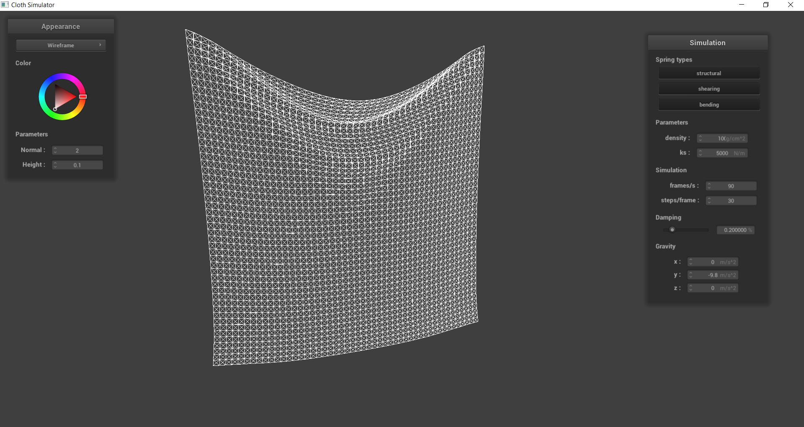
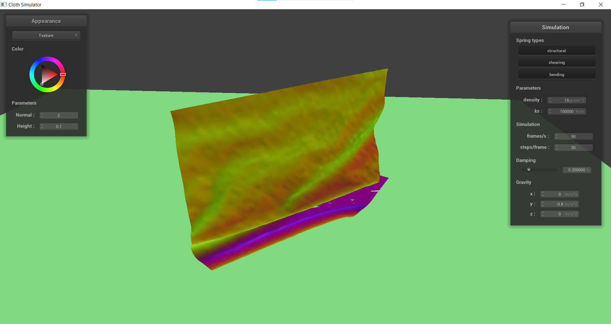

<h1 style="text-align: center;">Homework 4: Cloth Sim</h1>
<h2 style="text-align: center;">David Ban </h2>
<h2 style="text-align: center;">Sp 2024 </h2>

# Overview
In this project, I implemented a real-time simulation of a cloth using a mass-spring system. This was done by implementing a grid of connected Spring and PointMass objects, and then implementing the simulation aspect by adding physical equations to apply forces. Then, collisions were added for both spheres and planes, as well as self collisions. Finally, I added GLSL shaders to render unique shaders and texture mappings.

## Task 1: Masses and springs
In this section, I implemented a grid of springs and masses to represent a cloth. To accomplish this, I added PointMass objects to the grid, and then connecting them with Spring objects with three different types of constraints: Structural, Bending, and Shearing. These constraints can be seen below:

|   
Only Structural and Bending
|
|--|

|   
Only Shearing 
|
|--|

|   
All Constraints 
|
|--|

## Task 2: Simulation via numerical integration
In this section, I integrated the physical equations of motion to apply forces onto the springs on the cloth's PointMass objects. This was done by first calculating the total force acting on each mass point, then using Verlet integration to compute the new point mass positions. In order to make sure there weren't any extreme deformations, I also included an additional constraint that the spring's length can only be at most 10% greater than its original rest_length at the end of any time step. If it was greater, then I would correct it to be shorter.

 Simulating scene/pinned2.json with density 15 g/cm^2, damping of 0.2%, and varying the spring constant (ks):

|   **
ks = 10 N/m
** |   **
ks = 100 N/m
** |
|--|--|
|   **
ks = 1000 N/m
** |   **
ks = 10000 N/m
** |
|   **
ks = 1000000 N/m
** |

By inspection, we can see that a low spring constant will result in a "loose" cloth, or one that hangs more. Since the force is directly proportional to the spring constant, a small spring constant will result in a lower force, which means that the PointMasses are not pulled as tightly towards each other. This also means that a large spring constant results in a more "tight" cloth which can be seen in the bottom image with much less pull at the top center of the cloth as the first image.  

Simulating scene/pinned2.json with damping of 0.2%, spring constant (ks) of 5,000 N/m, and varying the density (g/cm^2):

|   **
Density = 1 g/cm^2
** |   **
Density = 10 g/cm^2
** |
|--|--|
|   **
Density = 100 g/cm^2
** |   **
Density = 100000 g/cm^2
** |

Density is directly proportional to the length of how much the "spring" is stretched. Thus, a larger density (or a heavier weighted cloth) should sag more than a lighter dense cloth, which can be seen in the images above. The smallest dense object looks barely stretched while the highest dense object seems like it is going to tear.

Simulating scene/pinned2.json with spring constant (ks) of 5,000 N/m, density 15 g/cm^2, and varying the damping percentage at the same time step:

|   **
Damping = 0%
** |   **
Damping = 1%
** |
|--|--|

These two images were taken at the same time stamp, with the only difference being the damping. Without it, there is nothing scaling the simulation velocity which represents the energy loss due to friction and other extraneous sources. This means that the cloth will continuously move and fling wildly, as seen in the image on the left. However, with a nonzero damping, we see that it will eventually stay at the hanging state, as there is no more energy left as it slows down.

Simulating scene/pinned2.json with spring constant (ks) of 5,000 N/m, density 15 g/cm^2, and damping of 0.2%:

<!-- final -->

## Task 3: Handling collisions with other objects

This section allowed us to make the cloth collide with other objects; more specifically, a sphere and a plane. I would first check to see if an intersection point existed, and if there was, I would basically "push" the pointmap back to the surface of the sphere. This was essentially done for the surface of the plane, except the specific calculation on how the intersection was calculated was different. 

 Simulating scene/sphere.json with density 15 g/cm^2, damping of 0.2%, and varying the spring constant (ks):

|   **
ks = 50 N/m normal
** |   **
ks = 50 N/m wireframe
** |
|--|--|
|   **
ks = 5000 N/m normal
** |   **
ks = 5000 N/m wireframe
** |
|   **
ks = 50000 N/m normal
** |   **
ks = 50000 N/m wireframe
** |

 Simulating scene/plane.json with density 15 g/cm^2, damping of 0.2%, and spring constant (ks) of 5,000 N/m:

## Task 4: Handling self-collisions

After being able to collide with other objects, we implemented the ability for self-collisions, or when a section of the cloth interacts with another section of the cloth. This was done by creating a hash function that would take a point mass position and map it to a float representing a specific box volume. Then, for each simulate call, the program would check for any self collisions on any PointMass based on the hash table. If there were, a correction vector would be applied to the current point mass to maintain a certain distance between the two.

 Simulating scene/selfCollision.json with damping of 0.2%, spring constant (ks) of 5,000 N/m, and density 15 g/cm^2:

|   **
Timestep 1
** |   **
Timestep 2
** |
|--|--|
|   **
Timestep 3
** |   **
Timestep 4
** |
|   **
Timestep 5
** |   **
Timestep 6
** |

By implementing self collision, we can see that the cloth no longer clips through itself as it falls to the ground. Instead, it folds and layers on top of itself due to the repelling forces of the cloth.

 Simulating scene/selfCollision.json with damping of 0.2%, spring constant (ks) of 5,000 N/m, and varying the density (g/cm^2):

|   **
Density = 1 g/cm^2, Timestep 1
** |   **
Density = 1 g/cm^2, Timestep 2
** |
|--|--|
|   **
Density = 100 g/cm^2, Timestep 1
** |   **
Density = 100 g/cm^2, Timestep 2
** |

When the density of the cloth is low, the cloth appears more smooth, such as piece of paper. The lower density results in less folds since there is less force pressing down on a section of the lower cloth. In Timestep 2 of the density = 1 image, we can see that the cloth is relatively flat and smooth near its resting state. However, with the density = 100, we see that there are much more wrinkles at both timesteps, like a blanket or quilt. This is because there is more force pressing down on a section resulting in a greater difference in forces and more folds.  

 Simulating scene/selfCollision.json with density 15 g/cm^2, damping of 0.2%, and varying the spring constant (ks):

|   **
ks = 100 N/m, Timestep 1
** |   **
ks = 100 N/m, Timestep 2
** |
|--|--|
|   **
ks = 100000 N/m, Timestep 1
** |   **
ks = 100000 N/m, Timestep 2
** |

The spring constant determines the stiffness. Thus, a less "stiff" cloth will result in more folds and wrinkles when it comes in contact with the ground  since there is no support from the springs. This results in a far more folded cloth in the second time stamp. In the stiffer cloth, we can see that the second timestamp has much less wrinkles, and is way smoother. 

## Task 5: Cloth Sim

This task tackled Shaders, which are independent programs that execute smaller sections of the graphics pipeline. This means that each shader program is isolated from each other which allows for parallelization in the GPU. In this section, we were able to write basic GLSL shaders by using vertex and fragment shaders. Vertex shaders apply transformations to vertices and modifying the geometric properties, while fragment shaders accept an input of a position (along with any other geometric attributes determined by the vertex shader), and performs a color calculation for a fragment.

 Simulating scene/sphere.json with density 15 g/cm^2, damping of 0.2%, and spring constant (ks) of 5,000 N/m using Blinn-Phong: 

|   **
Specular Component
** |   **
Specular Component
** |
|--|--|
|   **
Diffuse Component
** |   **
Diffuse Component
** |
|   **
Ambient Component
** |   **
Ambient Component
** |
|   **
 Entire Model
** |   **
 Entire Model
** |

Blinn-Phong is a shading model that is often used for approximating shiny surfaces in computer graphics. This is done by calculating the color of a pixel based on the light sources in the scene, and the surface properties of the 
object being rendered which consists of three components:
- Specular Shading: This is where the intensity depends on the view direction. I.e., the brightest near the mirror reflection direction.
- Diffuse Shading: This is where light is scattered uniformly in all directions, and the surface color is the same for all viewing directions.
- Ambient Shading: This does not depend on any properties, but just adds a constant color to account for disregarded illumination and to remove black shadows

 Simulating scene/sphere.json with texture mapping shader: 

|   **
Custom 🥺 image texture
** |   **
Custom 🥺 image texture
** |
|--|--|

 Simulating scene/sphere.json with texture_3.png (brick texture), using bump and displacement mapping shaders:

|   **
Bump Mapping
** |   **
Bump Mapping
** |
|--|--|
|   **
Displacement Mapping
** |   **
Displacement Mapping
** |

The difference between bump and displacement mapping is that bump involves storing the perterbations onto the surface normal, while displacement mapping involves storing the perturbations onto the surface position. I.e., it will actually modify the shape.

In bump mapping, the normal vectors of an object are modified so that the fragment shader gives the look of bumpiness by calculating new normals. Displacement mapping, however, physically alters the vertices, which will actually reflect the height map.

We can see in the images above that both bump and displacement both give off the illusion of physical texture. However, there is a difference, which can be seen on the edges of the sphere. In bump mapping, it's smooth, while in displacement mapping, the edges of the sphere are actually rough. You can also see this when the cloth is over the esphere, as the there are more folds in displacement which makes it look more pronounced.

 Simulating scene/sphere.json with texture_3.png (brick texture), varying the sphere mesh's coarseness:

|   **
Bump Mapping Resolution 16
** |   **
Bump Mapping Resolution 256
** |
|--|--|
|   **
Displacement Mapping Resolution 16
** |   **
Displacement Mapping Resolution 256
** 

The two bump mapping resolutions are basically the exact same. However, the displacement mapping's dependence on vertices results in differences based on the resolution. With fewer resolutions, the displacement image loses a lot of the detail, while an increased resolution has more vivid detail and realistic texture.
|

 Simulating scene/sphere.json with mirror shader: 
 

|   **
Mirror Shading
** |   **
Mirror Shading
** |
|--|--|

Here is the result of an environment-mapped reflection, where the scene is enclosed of a provided cubemap. We can then compute the outgoing ray from the camera, and reflect it off the surface normal and flipping the direction. We can then sample the environment map for the reflected direction.
